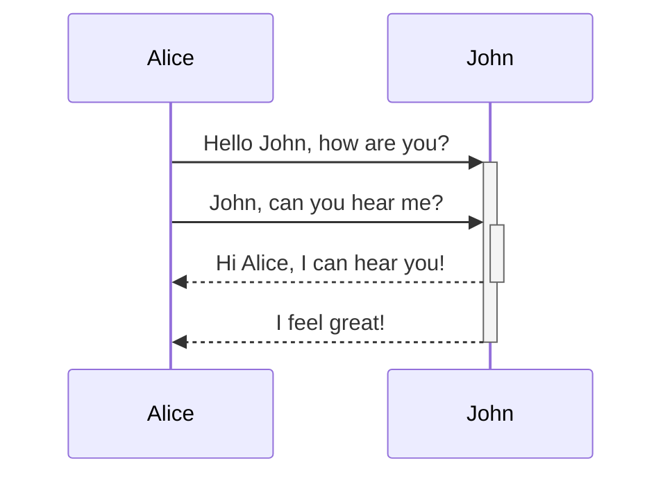
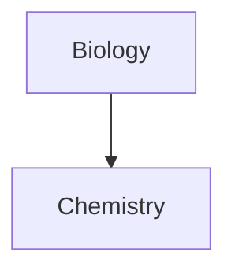

# Markdown tutorial

## Heading elements

```bash
# heading 1
## heading 2
### heading 3
#### heading 4
##### heading 5
###### heading 6
```

### Result

# heading 1
## heading 2
### heading 3
#### heading 4
##### heading 5
###### heading 6


## Italics (Emphasis)

```bash
*This will be italic*
_This will also be italic_
```

### Result

*This will be italic*

_This will also be italic_


## Bold (Strong)

```bash
**This will be bold**
__This will also be bold__
```

### Result

**This will be bold**

__This will also be bold__


## Combine bold and italic

```bash
_Also, you can **combine them**_
```

### Result

_Also, you can **combine them**_


## Lists

### Unnumbered Lists

```bash
- Item 1
- Item 2
    - Subitem 1
    - Subitem 2
        - And so on

(seperated by tabs)
```

### Result

- Item 1
- Item 2
    - Subitem 1
    - Subitem 2
        - And so on

### Numbered Lists

```bash
1. Item 1
1. Item 2
    1. Subitem 1
    1. Subitem 2
        1. And so on

(seperated by tabs)
```

### Result

1. Item 1
1. Item 2
    1. Subitem 1
    1. Subitem 2
        1. And so on


## Create a loose list by adding a blank line between any two list items

```bash
- Item 1

- Item 2
- Item 3
```

### Result

- Item 1

- Item 2
- Item 3


## Images

```bash
Remote Images


Local Images

```

### Result


## Links

```bash
[Link to my portfolio](https://angkush.vercel.app/)
```

### Result

[Link to my portfolio](https://angkush.vercel.app/)


## Blockquote

```bash
> This is a blockquote here. This is going to be some random text in here just to fill this portion with some text. The quick brown fox jumps over the lazy dog.

\- Angkush Sahu

```

### Result

> This is a blockquote here. This is going to be some random text in here just to fill this portion with some text. The quick brown fox jumps over the lazy dog.

\- Angkush Sahu


## Code

```bash
1. Inline Code
`hello world`, this is going to be awesome

2. Codeblock
```js
function sayHi(str) {
    if (str === "say hi") {
        console.log(str);
    }
}

3.
    Text indented with a tab is formatted like this, and will also look like a code block in preview.
```

### Result

**Inline Code**

`hello world`, this is going to be awesome

**Codeblock**
```js
function sayHi(str) {
    if (str === "say hi") {
        console.log(str);
    }
}
```

    Text indented with a tab is formatted like this, and will also look like a code block in preview.


## Task list

```bash
- [x] Javascript
- [x] CSS
- [x] React
- [x] Node
- [ ] Flutter
- [ ] DSA
```

### Result

- [x] Javascript
- [x] CSS
- [x] React
- [x] Node
- [ ] Flutter
- [ ] DSA


## Tables

```bash
|First Column | Second Column|
|------------ | -------------| (Number of dashes does not matter, just for beautification purpose, we filled the cells)
|Content for first column | Content for second column|
|Content for first column | Content for second column|

OR

First Column | Second Column
------------ | -------------
Content for first column | Content for second column
Content for first column | Content for second column

JUSTIFY TABLE CELLS

First Column | Second Column | Third Column
:------------ | -------------: | :------------:
Content for first column | Content for second column | Content for third column
Content for first column | Content for second column | Content for third column
```

### Result

|First Column | Second Column|
|------------ | -------------|
|Content for first column | Content for second column|
|Content for first column | Content for second column|

First Column | Second Column
------------ | -------------
Content for first column | Content for second column
Content for first column | Content for second column

First Column (Left Justified) | Second Column (Right Justified) | Third Column (Center Justified)
:------------ | -------------: | :------------:
Content for first column | Content for second column | Content for third column
Content for first column | Content for second column | Content for third column


## Strikethrough

```bash
This is ~~striked~~ text
```

### Result

This is ~~striked~~ text


### Result

This is ==highlighted== text


## Horizontal bar

```bash
lorem ipsum
___
lorem ipsum dolor isit amet consectutor.
```

### Result

lorem ipsum
___
lorem ipsum dolor isit amet consectutor.


## Math

```bash
$$\begin{vmatrix}a & b\\
c & d
\end{vmatrix}=ad - bc$$

$e^{2i\pi} = 1$
```

### Result

$$\begin{vmatrix}a & b\\
c & d
\end{vmatrix}=ad - bc$$

$e^{2i\pi} = 1$


## Diagram

```bash
```mermaid
sequenceDiagram
    Alice->>+John: Hello John, how are you?
    Alice->>+John: John, can you hear me?
    John-->>-Alice: Hi Alice, I can hear you!
    John-->>-Alice: I feel great!

```mermaid
graph TD

Biology --> Chemistry
```

### Result



